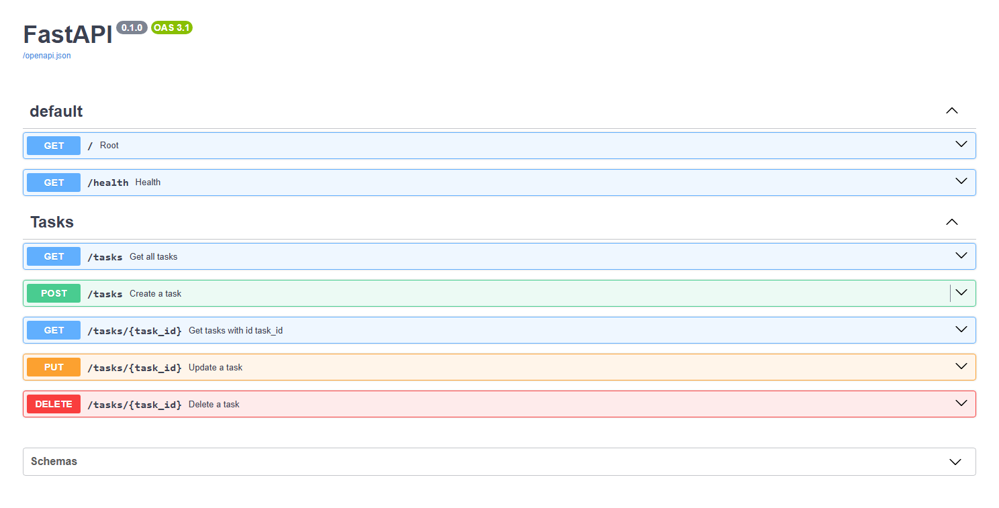

# Task API

**FlyRank Backend Internship Assignment 1 – Week 2**

**Date:** 18 July 2026

## Overview

Task API is a simple RESTful API built using **Python** and **FastAPI** for the FlyRank Backend Internship Assignment.

It supports basic CRUD operations (Create, Read, Update and Delete) for managing tasks using an **in-memory data store**. Since no database is used, all data is reset whenever the server restarts.

---

## Installation & Running

### 1. Install dependencies

```bash
pip install -r requirements.txt
```

### 2. Run the application

```bash
uvicorn app.main:app --reload
```

The API will be available at:

```
http://localhost:8000
```

Swagger documentation:

```
http://localhost:8000/docs
```

---

## API Endpoints

| Method | Endpoint | Description |
|---------|----------|-------------|
| GET | `/` | API information |
| GET | `/health` | Health check |
| GET | `/tasks` | Get all tasks |
| GET | `/tasks/{task_id}` | Get a task by ID |
| POST | `/tasks` | Create a new task |
| PUT | `/tasks/{task_id}` | Update an existing task |
| DELETE | `/tasks/{task_id}` | Delete a task |

---

## Example cURL Request

Command

```bash
curl -i -X POST http://localhost:8000/tasks -H "Content-Type: application/json" -d "{\"title\":\"Buy milk\"}"
```

Example Output

```http
HTTP/1.1 201 Created
date: Sat, 18 Jul 2026 18:31:07 GMT
server: uvicorn
content-length: 40
content-type: application/json

{"id":4,"title":"Buy milk","done":false}
```

---

## Swagger Documentation



---
## Project Structure
```
app/
├── models/
├── routes/
├── services/
├── utils/
├── data.py
└── main.py
```

The project follows a layered architecture where routes handle HTTP requests, services contain business logic, and models define request/response schemas.