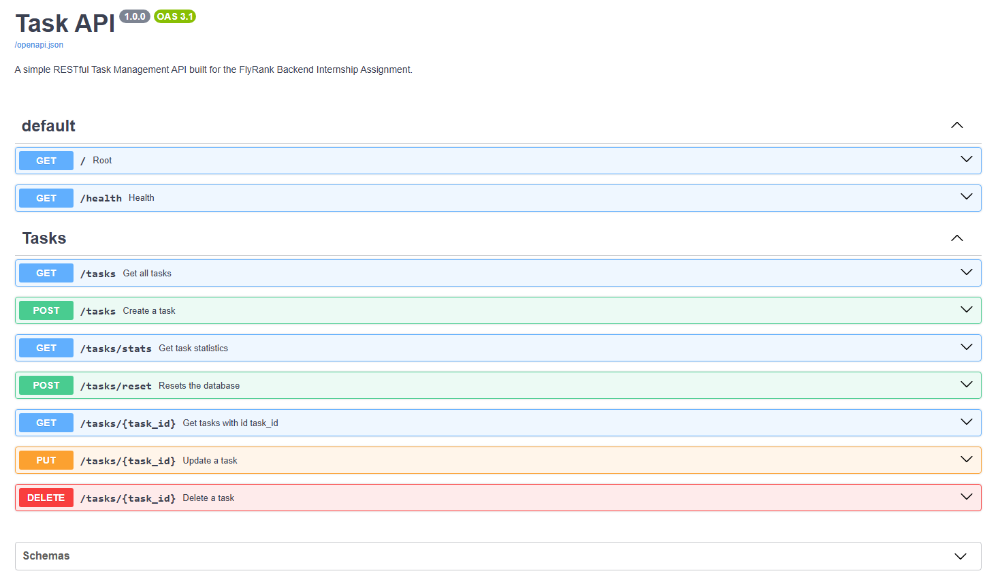
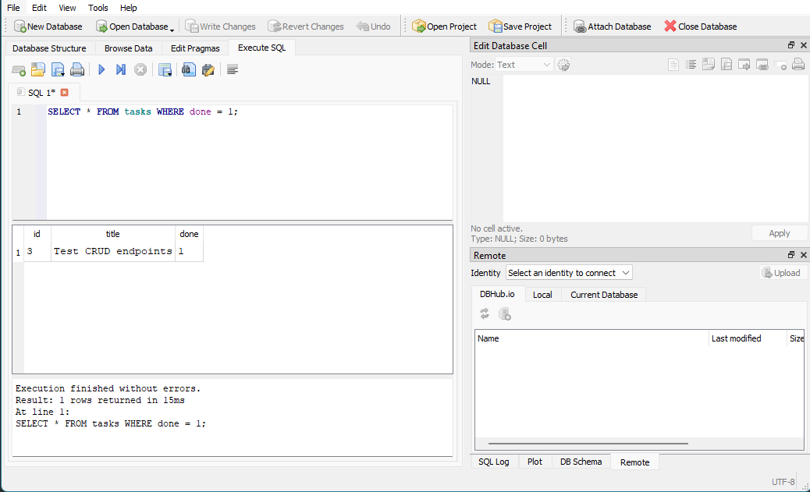
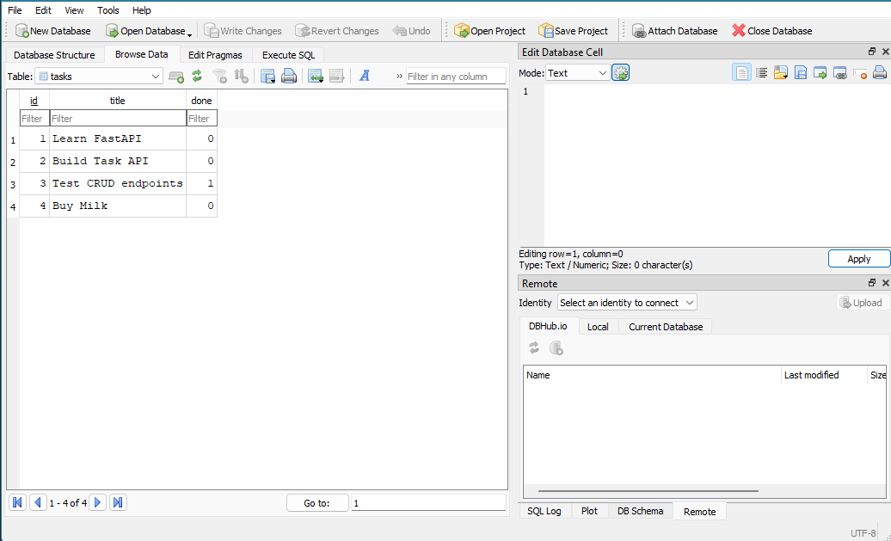

# Task API

**FlyRank Backend Internship - Assignment 2**

---

## Overview

Task API is a simple RESTful API built using **Python** and **FastAPI** for the FlyRank Backend Internship Assignment.

It provides a RESTful interface for managing tasks using a **SQLite database**, supporting full CRUD operations along with filtering, searching, pagination, task statistics, and resetting the seeded task list.

The application automatically creates and initializes the database on startup if it does not already exist, ensuring data persists across server restarts.


---

## Installation & Running

### 1. Create a virtual environment (recommended)

**Windows**

```bash
python -m venv .venv
.venv\Scripts\activate
```

**Linux/macOS**

```bash
python3 -m venv .venv
source .venv/bin/activate
```

### 2. Install dependencies

```bash
pip install -r requirements.txt
```

### 3. Run the application

On first startup, the application automatically creates a `tasks.db` SQLite database and seeds it with initial tasks if the database is empty.

```bash
uvicorn app.main:app --reload
```

The API will be available at:

```
http://localhost:8000
```

Interactive Swagger documentation:

```
http://localhost:8000/docs
```

---

## API Endpoints

| Method | Endpoint | Description |
|---------|----------|-------------|
| GET | `/` | API information |
| GET | `/health` | Health check |
| GET | `/tasks` | Retrieve all tasks (supports filtering, searching and pagination) |
| GET | `/tasks/{task_id}` | Retrieve a task by ID |
| POST | `/tasks` | Create a new task |
| PUT | `/tasks/{task_id}` | Update an existing task |
| DELETE | `/tasks/{task_id}` | Delete a task |
| GET | `/tasks/stats` | Retrieve task statistics |
| POST | `/tasks/reset` | Restore the original seeded task list |

---

## Supported Query Parameters

`GET /tasks` supports the following optional query parameters:

| Parameter | Description | Example |
|-----------|-------------|---------|
| `done` | Filter by completion status | `/tasks?done=true` |
| `search` | Search task titles (case-insensitive) | `/tasks?search=milk` |
| `limit` | Maximum number of tasks returned | `/tasks?limit=5` |
| `offset` | Number of tasks to skip | `/tasks?offset=5` |

Query parameters can also be combined:

```text
GET /tasks?done=true&search=milk&limit=2&offset=0
```

---

## Example cURL Request

Command

```bash
curl -i -X POST http://localhost:8000/tasks -H "Content-Type: application/json" -d "{\"title\":\"Buy milk\"}"
```

Example Output

```http
HTTP/1.1 201 Created
date: Sat, 18 Jul 2026 18:31:07 GMT
server: uvicorn
content-length: 40
content-type: application/json

{"id":4,"title":"Buy milk","done":false}
```

---

## Swagger Documentation

The API is fully documented using FastAPI's automatically generated Swagger UI.



---

## Project Structure

```text
app/
├── models/
├── routes/
├── services/
├── utils/
├── database.py
└── main.py
```

The project follows a layered architecture:

- **routes/** – HTTP endpoints and request handling
- **services/** – Business logic
- **models/** – Pydantic request/response models
- **database.py** – SQLite database initialization and connection management
- **utils/** – Shared helper functions (validation)

This separation keeps routing, validation and business logic independent and easier to maintain.

---

## SQLite Persistence

The application uses **SQLite** as its persistence layer.

On application startup:

- `tasks.db` is created automatically if it does not already exist.
- The `tasks` table is created automatically if required.
- Initial seed tasks are inserted only when the table is empty.

Unlike the previous in-memory implementation, tasks now persist across server restarts, providing durable storage without requiring an external database server.

---

## Database

The project uses Python's built-in `sqlite3` module.

Task data is stored in the automatically created `tasks.db` file located in the project root.

The API performs all CRUD operations directly against the SQLite database using parameterized SQL queries to safely handle user input.

---

## Additional Features

Beyond the core CRUD functionality, the API also includes:

- SQLite-based persistent storage
- Automatic database initialization and seeding
- Task filtering using `done`
- Case-insensitive task searching
- Pagination using `limit` and `offset`
- Task statistics endpoint
- Reset endpoint to restore seeded tasks
- Request validation with custom error responses
- Interactive Swagger/OpenAPI documentation

---

## Assignment 2 Changes

Compared to Assignment 1, the following improvements were made:

- Replaced the in-memory task list with a SQLite database.
- Preserved the existing REST API contract and endpoint behavior.
- Moved filtering, searching, pagination and statistics into SQL queries.
- Added automatic database creation and initialization on application startup.
- Implemented persistent storage across server restarts.

---
## Inspecting the Database

The SQLite database can be inspected using any SQLite-compatible viewer such as:

- DB Browser for SQLite
- VS Code SQLite extensions

This makes it possible to verify database contents after performing CRUD operations through the API.

Sample Query used from Stage 4


Database viewed using DBbrowser
